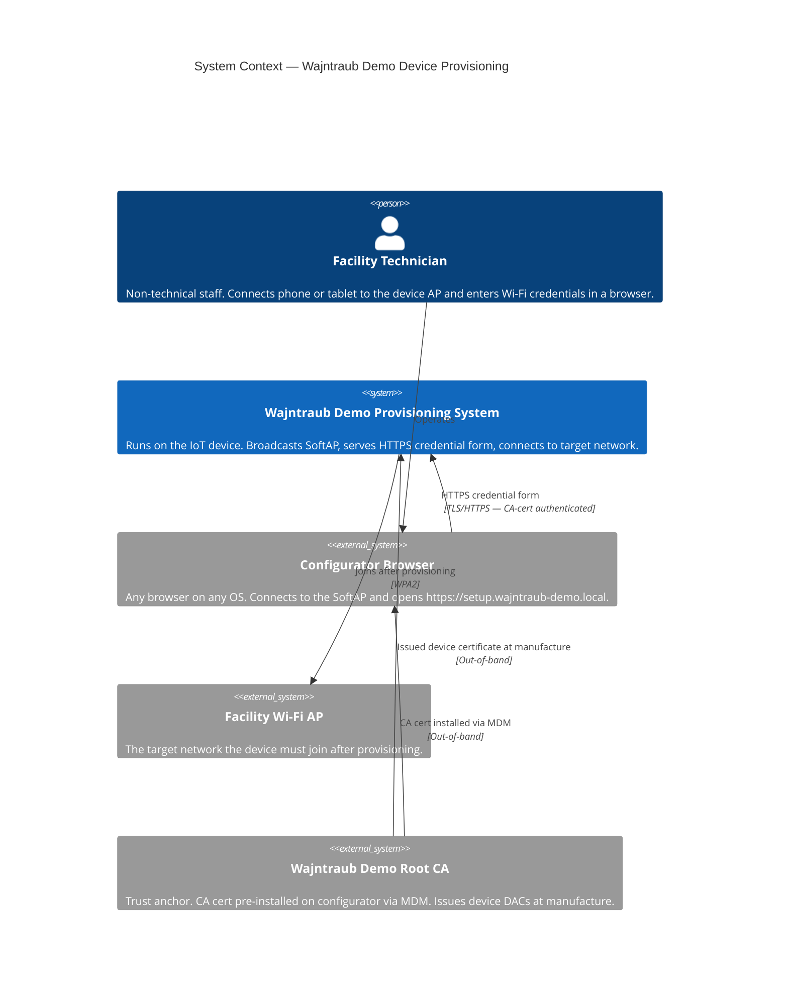
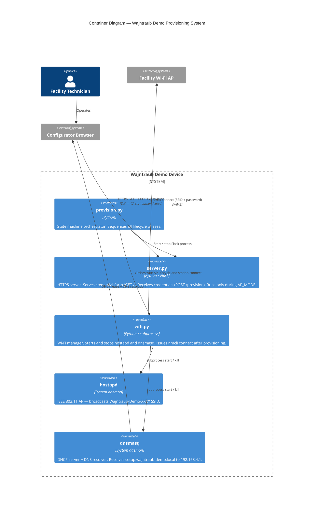
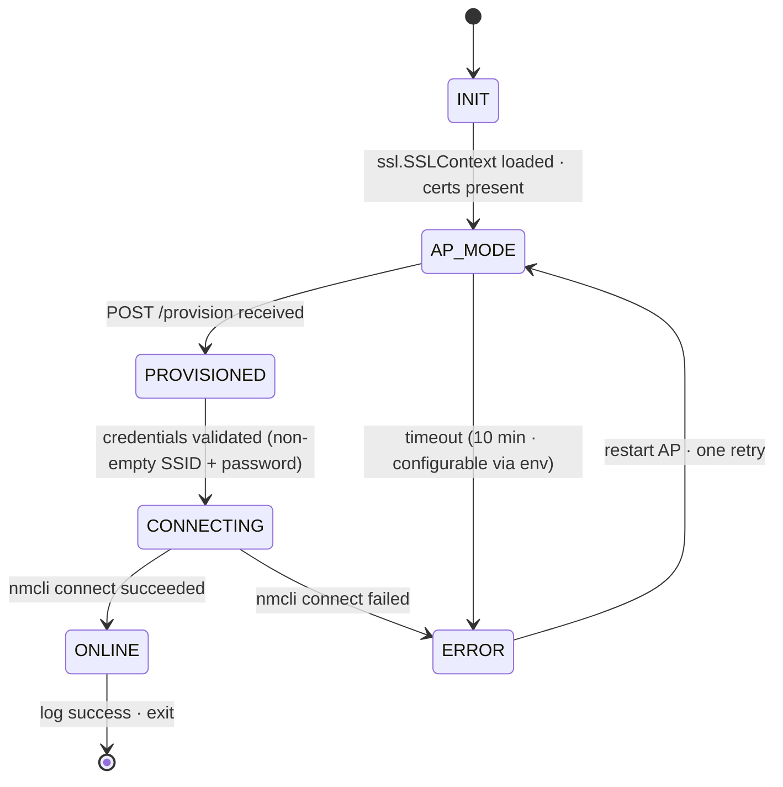
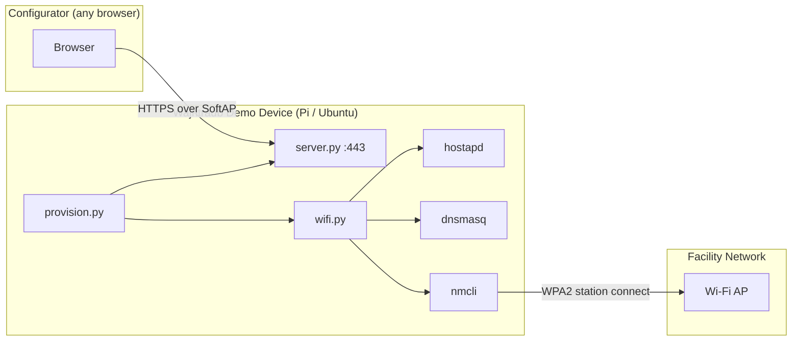

# teton-challenge — Architecture

## 1. Overview

An offline-first provisioning system for IoT devices. The Wajntraub Demo Device broadcasts a Wi-Fi access point; a facility technician connects via any browser, is authenticated by the device's CA-signed TLS certificate, and submits Wi-Fi credentials over an encrypted HTTPS channel. The device then tears down the AP and connects to the target network using the received credentials. No internet connection is required at any point during provisioning. The configurator is any browser — no dedicated app is needed.

The trust model relies on a device certificate issued to each device at manufacture time, anchored to the Wajntraub Demo CA. The CA certificate is the only out-of-band artefact: distributed once via MDM before field deployment.

### Context Diagram (C4 Level 1)



---

## 2. Key Architectural Decisions

| # | Decision | Rationale | Alternatives Considered |
|---|---|---|---|
| AD-1 | **SoftAP as provisioning channel** | No extra hardware on either side; works on any browser and OS; well-understood IoT pattern; fully reproducible with standard Linux tools | BLE (Linux stack unreliable for demo), Ethernet (requires cable + port), QR/DPP (doesn't scale), NFC (hardware dependency on both sides) |
| AD-2 | **CA-signed device certificate** | Single Wajntraub Demo CA cert covers all devices at any fleet size; closes rogue device attack without a dedicated app; same model scales to TPM-backed hardware identity in production with no architecture change | Self-signed TLS (encryption without authentication — fails under rogue AP), PAKE (high implementation cost, no meaningful advantage here), cert pinning (requires O(n) cert distribution at fleet scale) |
| AD-3 | **DNS + known URL over captive portal** | Captive portal CNAs are HTTP-based, exempt from MDM browser policies, and behave inconsistently across iOS/Android/Windows; DNS + known URL (`setup.wajntraub-demo.local`) works identically in every standard browser | OS captive portal (CNA quirks), manual IP entry (`192.168.4.1` — fragile UX for non-developers) |
| AD-4 | **Python 3 + Flask** | The provisioning server handles one GET and one POST then shuts down; no async required; immediately readable by any evaluator; stdlib covers everything needed (ssl, subprocess, threading) with no unusual dependencies | FastAPI (unnecessary for 2 routes), Node.js (no benefit over Flask here) |
| AD-5 | **Software RSA key for TLS** | Python's `ssl.SSLContext.load_cert_chain()` uses `fopen()` and cannot resolve TPM store URIs — ruling out a direct TPM integration for this demo. A software RSA key generated by `setup.sh` keeps the demo fully self-contained and reproducible on any Ubuntu or Pi OS machine without additional hardware. Production upgrade path: tpm2-pkcs11 exposes the TPM key via PKCS#11, reachable from Python ssl via `pkcs11:` URI — one line change in `provision.py`, private key stays hardware-bound. | Hardware TPM via tpm2-pkcs11 (requires TPM hardware — out of scope for demo), self-signed cert (no authentication — fails under rogue AP attack) |
| AD-6 | **HSTS for HTTP rogue portal mitigation** | Dynamic HSTS headers close the HTTP-redirect gap; HSTS preload (baked into browser binary at compile time, works fully offline) is the production hardening step — demo sets headers, preload requires formal domain submission | Dedicated app with cert pinning (additional implementation cost; preload achieves equivalent protection using a standard browser) |

---

## 3. Technology Stack

| Layer | Technology | Version | Justification |
|---|---|---|---|
| Provisioning server | Python 3 + Flask | Python 3.11+, Flask 3.x | Minimal, readable; handles 2 routes and shuts down |
| TLS (demo) | Software RSA key via `ssl.SSLContext` | OpenSSL 3.x | Python ssl module cannot load TPM keys directly (see AD-5); software key used for demo reproducibility |
| TLS (production) | tpm2-pkcs11 + OpenSSL PKCS#11 provider | — | Exposes TPM key via PKCS#11; reachable from Python ssl via `pkcs11:` URI; private key never leaves hardware |
| SoftAP | hostapd | latest apt | Standard Linux Wi-Fi AP daemon |
| DHCP + DNS | dnsmasq | latest apt | One config line adds DNS for `setup.wajntraub-demo.local`; already needed for DHCP |
| Network management | nmcli (NetworkManager) | latest apt | Standard on Pi OS and Ubuntu; handles station connect and disconnect |
| CA / cert tooling | OpenSSL CLI | 3.x | One-time setup script; generates demo CA and signs device CSR |
| Test framework | pytest | latest | Standard Python test runner |

---

## 4. Component Architecture

### Container Diagram (C4 Level 2)



### State Machine



### Component Breakdown

| Component | Type | Responsibility | Governing ADs |
|---|---|---|---|
| `provision.py` | Server | State machine entry point. Sequences INIT → AP_MODE → PROVISIONED → CONNECTING → ONLINE. Constructs `ssl.SSLContext` (software key + device cert) once during INIT. Creates `threading.Event` and credentials dict; calls `server.create_server(credentials, event, ssl_context)` each time it enters AP_MODE (initial and retry); waits on event (10 min timeout → ERROR); calls `wifi.py` with credentials after event fires. On `ERROR → AP_MODE` retry (expected case: nmcli failure), the existing `ssl.SSLContext` is reused — no rebuild. | AD-1, AD-5 |
| `server.py` | Server | Flask HTTPS app served via `werkzeug.serving.make_server()` in a thread. Exposes `create_server(credentials, event, ssl_context, result, result_event)` factory — accepts the pre-built `ssl.SSLContext` from `provision.py`; returns a `(BaseWSGIServer, Thread)` pair. `GET /` serves credential form. `POST /provision` validates credentials, stores in shared dict, sets the credentials `threading.Event`, then **long-polls**: blocks on `result_event.wait(timeout=60)` until the state machine resolves the connect attempt. On success, starts `shutdown_callback` in a daemon thread and returns the success page. On failure, returns the error page with a user-facing reason; `provision.py` calls `srv.shutdown()` explicitly on this path to free port 443 before retry. `provision.py` joins the server thread after `result_event` is set — ensuring port 443 is released before rebind. Sets HSTS response header on every response. All HTML is inline in `server.py` — no template engine, no `templates/` directory. | AD-3, AD-4, AD-6 |
| `wifi.py` | Server | Wraps `hostapd`, `dnsmasq`, and `nmcli` subprocess calls. Owns the full SoftAP lifecycle: renders a `hostapd.conf` inline template to a temp file (substituting interface and MAC-derived SSID suffix), starts hostapd and dnsmasq (dnsmasq via CLI arguments — no conf file), assigns `192.168.4.1` to the interface, stops daemons on teardown, and issues the final `nmcli` station connect. Exposes `start_ap(iface)`, `stop_ap()`, and `connect(ssid, password)`. Raises `WifiConnectError` on nmcli failure with a user-facing message distinguishing wrong password from SSID not found. | AD-1, AD-3 |
| `hostapd` | System daemon | Broadcasts the SoftAP SSID as an open AP (no PSK). Config written to a temp file by `wifi.py` at AP start from an inline template, substituting `PROVISION_IFACE`. | AD-1 |
| `dnsmasq` | System daemon | DHCP on SoftAP subnet (`192.168.4.2–192.168.4.20`, 24h lease) + DNS resolution for `setup.wajntraub-demo.local → 192.168.4.1`. Started by `wifi.py` with CLI arguments — no conf file. | AD-3 |
| `setup.sh` | Script | One-time setup: generates Wajntraub demo CA, generates software device key, signs device CSR with demo CA. Outputs `certs/device.key`, `certs/device.crt`, `certs/wajntraub-demo-ca.crt`. Idempotent (overwrites on each run). | AD-2, AD-5 |
| `install-ca.sh` | Script | Ubuntu-only convenience script for the one-machine demo setup (device and browser on the same machine). Copies `certs/wajntraub-demo-ca.crt` to `/usr/local/share/ca-certificates/` and runs `update-ca-certificates` (covers Chrome). Runs `certutil -A` against `~/.mozilla/firefox/*.default-release/` if a Firefox profile exists. Requires `libnss3-tools`. Idempotent. Windows / macOS / iOS / Android: manual cert import — documented in README. | AD-2 |

---

## 5. Data Model

No persistent storage. All data is in-flight for the duration of one provisioning session.

**Provision request payload** (POST /provision body, `application/x-www-form-urlencoded`):

| Field | Type | Validation |
|---|---|---|
| `ssid` | string | Non-empty |
| `password` | string | Non-empty |

**State machine enum:**

```
ProvisionState = { INIT, AP_MODE, PROVISIONED, CONNECTING, ONLINE, ERROR }
```

**Credential flow** (in-memory, one provisioning session):

```
POST /provision → server.py validates → stored in shared dict {ssid, password}
threading.Event set → provision.py unblocks → wifi.py.connect(ssid, password)
nmcli exits → credentials discarded (dict goes out of scope)
```

**Error state payload:**

| Field | Type | Notes |
|---|---|---|
| `error_reason` | string | e.g. `"nmcli connect failed"`, `"timeout"` — logged and shown on error page |

**TLS certificate chain** (in-memory during TLS handshake):

```
wajntraub-demo-ca.crt     Root of trust — installed on configurator via MDM
  └── device.crt           Device certificate — CN=setup.wajntraub-demo.local
        └── device.key     Private key — software RSA (demo); TPM-bound via tpm2-pkcs11 (production)
```

---

## 6. API Design

The provisioning server exposes two routes. It is live only during AP_MODE and shuts down after a successful POST.

| Method | Path | Description | Auth |
|---|---|---|---|
| `GET` | `/` | Returns HTML credential form. | TLS (cert verified during handshake) |
| `POST` | `/provision` | Receives `ssid` + `password` (form-encoded). Validates non-empty. Returns success or error page. Triggers PROVISIONED state transition. | TLS (cert verified during handshake) |

All routes are served over HTTPS only (port 443). Every response includes `Strict-Transport-Security: max-age=31536000`.

---

## 7. Infrastructure & Deployment

### Deployment Diagram



### Project Layout

```
teton-challenge/
├── device/                   # Source — NOT a Python package (no __init__.py)
│   ├── provision.py          # State machine entry point
│   ├── server.py             # Flask HTTPS server
│   └── wifi.py               # SoftAP + nmcli subprocess wrapper
├── scripts/
│   ├── setup.sh              # One-time demo setup (CA + device cert)
│   └── install-ca.sh         # Ubuntu-only CA install helper
├── tests/
│   ├── conftest.py           # Adds device/ to sys.path; shared cert fixtures
│   └── unit/
│       ├── test_state_machine.py
│       ├── test_validation.py
│       └── test_wifi_commands.py
├── requirements.txt          # flask
└── requirements-test.txt     # pytest
```

`device/` is a scripts directory. Running `python3 device/provision.py` adds `device/` to `sys.path` automatically. For tests, root `tests/conftest.py` inserts `device/` into `sys.path` so that `import provision`, `import server`, `import wifi` resolve without package qualification. Mock patch strings use unqualified module names: `patch('wifi.subprocess.run')`, `patch('provision.ssl.SSLContext')`.

### Bare-Metal Requirements

**Target platforms:** Ubuntu 22.04+, Raspberry Pi OS Bookworm (64-bit)

**System packages (apt):**
```
hostapd dnsmasq network-manager python3 python3-pip openssl libnss3-tools
```

**Python runtime packages (`requirements.txt`):**
```
flask
```

**One-time setup:** `sudo ./scripts/setup.sh`

**Run:** `sudo python3 device/provision.py`

**Platform notes:**
- Requires `root` for port 443, `hostapd`, `dnsmasq`, and `nmcli`
- On Raspberry Pi: the BCM43xx handles AP and station roles sequentially — the SoftAP must be torn down before `nmcli connect`; concurrent AP + station mode is not supported on this chip

### Production Service Packaging

This demo uses a manually invoked process and a repo-local `.venv`. For a production device fleet:

| Step | Approach |
|---|---|
| **Service lifecycle** | Replace manual invocation with a `systemd` unit. `ExecStart=/opt/wajntraub-provision/.venv/bin/python3 device/provision.py` gives auto-start on boot, restart on failure, and `journald` logging — no terminal session required. |
| **Packaging** | Build a `.deb` (using `fpm` or a `debian/` directory). The `postinst` script runs `setup.sh`, creates the venv, installs deps, and enables the systemd unit. Installation becomes `dpkg -i wajntraub-provision_1.0_arm64.deb`. |

### CI/CD

Not applicable for this submission. Manual setup and run per README.

---

## 8. Test Strategy

### Test Levels

| Level | Scope | Tools | Coverage Target |
|---|---|---|---|
| Unit | State machine transitions, credential validation, subprocess argument construction, cert path verification | pytest, `unittest.mock` | All state transitions and all validation paths |

### Test Architecture

```
tests/
├── conftest.py               # Shared fixtures: temp cert dirs, cert generation helpers
└── unit/
    ├── test_state_machine.py
    ├── test_validation.py
    └── test_wifi_commands.py
```

### Test Isolation

Tests are strictly isolated from the demo environment:

- **Certs:** Tests generate short-lived test CA and device certs in `pytest.tmp_path`. The demo's `certs/` directory is never read or written by tests. The system trust store is never modified.

### Test Dependencies

Tracked separately from runtime dependencies. All test dependencies are listed in README.

**`requirements-test.txt`:**
```
pytest
```

**Unit test mock targets:**
- `subprocess` calls in `wifi.py`: patch at usage module — `unittest.mock.patch('wifi.subprocess.run')` / `patch('wifi.subprocess.Popen')`
- `ssl.SSLContext` construction in `provision.py`: patch via `unittest.mock.patch('provision._load_ssl_context')` — avoids needing real cert files in unit tests

### What NOT to Test

- `hostapd`, `dnsmasq`, `nmcli` internal behavior — OS tools, not our code
- TLS protocol correctness — delegated to OpenSSL
- TPM cryptographic operations — out of scope for this demo (production concern)
- Browser rendering of HTML templates

---

## 9. Security Considerations

### Threat Surface

| Vector | Description | Mitigation |
|---|---|---|
| Rogue HTTPS device | Attacker broadcasts identical SSID, serves HTTPS with any cert | Browser rejects — attacker cannot obtain a cert signed by Wajntraub Demo CA |
| Rogue HTTP device | Attacker serves plain HTTP on `setup.wajntraub-demo.local` | HSTS response header on all responses; HSTS preload (production) bakes HTTPS-only into browser binary, works fully offline |
| Credential interception | Passive or active MitM captures POST body | Closed by TLS encryption — session key established via authenticated handshake |
| Software key on disk | `certs/device.key` is a file readable by root — attacker with root access can extract the private key | Accepted demo trade-off; production uses tpm2-pkcs11 with hardware TPM — private key never leaves the chip |
| Replay of provisioning request | Attacker captures HTTPS POST and replays it | TLS 1.3 ephemeral key exchange — captured sessions cannot be replayed |
| Repeated POST attempts | Repeated provisioning attempts against the running server | Server accepts one valid POST then shuts down; no repeated-attempt surface |

### Authentication & Authorization

- **Auth mechanism:** TLS. Device presents its certificate (CN=`setup.wajntraub-demo.local`, signed by Wajntraub Demo CA). Browser verifies against pre-installed Wajntraub Demo CA cert.
- **No user authentication:** The credential form is accessible to any device that can reach the server on the SoftAP subnet. Physical proximity to the device is the access control boundary.
- **Session lifetime:** Flask server is live only during AP_MODE. It exits after one successful POST. No session tokens; no cookies.

### Input Validation

- `ssid`: non-empty string — enforced in `POST /provision` handler before passing to `wifi.py`
- `password`: non-empty string — same
- Credentials are passed to `nmcli` as discrete arguments, not interpolated into a shell string — no shell injection surface

### Secrets Management

In production, the manufacturer holds `wajntraub-demo-ca.key` in an HSM and pre-signs device certs at manufacture. The evaluator never sees it.

In the demo, `setup.sh` simulates the full manufacturing step locally. The evaluator plays every role:

```
setup.sh (runs on evaluation machine):
  1. Generates wajntraub-demo-ca.key + certs/wajntraub-demo-ca.crt   ← evaluator acts as Wajntraub Demo CA
  2. Generates software RSA device key (certs/device.key)
  3. Creates device.csr and signs with wajntraub-demo-ca.key → certs/device.crt
  4. wajntraub-demo-ca.key stays on disk — used if setup.sh is re-run; never committed
```

After `setup.sh`, the evaluator installs `certs/wajntraub-demo-ca.crt` on their browser via `install-ca.sh`. The entire `certs/` directory is gitignored — `setup.sh` generates all files at evaluation time.

| Secret | Location | Notes |
|---|---|---|
| `certs/device.key` | Local only, gitignored | Software RSA private key; used by Flask for TLS. Production: replaced by tpm2-pkcs11 — key lives in TPM, never exported |
| `wajntraub-demo-ca.key` | `certs/wajntraub-demo-ca.key` — local only, gitignored | Generated by `setup.sh`; used to sign `device.crt`; never committed |
| `certs/device.crt` | Local only, gitignored | Public cert; generated by `setup.sh`; presented by Flask during TLS handshake |
| `certs/wajntraub-demo-ca.crt` | Local only, gitignored | Public cert; generated by `setup.sh`; installed on evaluator's browser via `install-ca.sh` |

### Known Risks & Accepted Trade-offs

| Risk | Severity | Accepted? | Justification |
|---|---|---|---|
| Software private key on disk (`certs/device.key`) | Medium | Yes — demo only | Root-readable file; production uses tpm2-pkcs11 with hardware TPM — key never leaves chip |
| No HSTS preload on `setup.wajntraub-demo.local` | Medium | Yes — demo only | Preload requires formal domain submission; evaluators navigate directly to `https://`; documented as production step |
| No mutual TLS (client auth) | Low | Yes | Device identity is the security requirement; configurator identity is not — any technician with physical proximity is authorized |
| Port 443 requires root | Low | Yes | Bare-metal provisioning daemon on a dedicated embedded device |

---

## 10. Observability

- **Logging:** Python `logging` module, format `%(asctime)s %(levelname)s %(message)s`. One log line per state transition at INFO level. Errors include exception info.
- **State transitions logged at INFO:** `INIT`, `AP_MODE`, `PROVISIONED`, `CONNECTING`, `ONLINE`, `ERROR`
- **Submission evidence:** Terminal log output + browser screenshots (form, success/failure page) + video recording of end-to-end provisioning flow

No external logging infrastructure. Standalone embedded provisioning daemon.

---

## 11. Submission Responses

The following sections answer the three specific questions required by the challenge brief.

---

### 11.1 — Why this communication channel, and what was traded off?

**Choice: Wi-Fi SoftAP**

The Wajntraub Demo Device broadcasts a Wi-Fi access point via `hostapd`. The configurator connects to it and opens a browser. Credentials are submitted via an HTTPS form served by the device.

**Why SoftAP:**

- **No extra hardware on either side.** Every phone, tablet, and laptop can connect to a Wi-Fi AP and open a browser. No app, no dongle, no cable.
- **No shared infrastructure.** The channel is self-contained between the two devices — no existing network, no internet, no cloud relay. Satisfies the hard no-internet constraint directly.
- **Usable by a non-developer.** "Connect to Wajntraub-Demo-XXXX Wi-Fi, open browser, type setup.wajntraub-demo.local" is a flow a facilities technician can follow in a hospital hallway.
- **Well-understood IoT pattern.** Reproducible on any Linux device with a Wi-Fi interface using standard apt packages. Fully testable without physical hardware using `mac80211_hwsim`.

**Trade-offs accepted:**

- **One device at a time.** SoftAP is a point-to-point flow: one technician, one device, one session. For simultaneous provisioning at scale, see Section 13.3.
- **Technician must manually connect to the SoftAP.** Most platforms show a captive portal notification automatically; some require manual browser navigation. Accepted for the benefit of requiring no dedicated app.
- **The SSID is not a security boundary.** Any device can broadcast the same SSID. This is not a weakness — security is enforced entirely at the TLS layer (see Section 13.2), making SSID spoofing irrelevant.

**Channels rejected:**

| Channel | Reason rejected |
|---|---|
| BLE | Linux BlueZ stack unreliable for demo; hard to reproduce on Ubuntu without dedicated hardware |
| Ethernet | Eliminates wireless attack surface entirely but requires a physical cable and exposed port — not viable for field deployment |
| QR code / DPP | Doesn't scale past ~3 devices; sticker-based; scanning is a fragile UX step at volume |
| PAKE (SPAKE2, J-PAKE) | Cryptographically sound but high implementation cost; no advantage over CA-signed device certificates for this fleet model |
| NFC | Hardware dependency on both sides; short range makes multi-device awkward |

---

### 11.2 — How are credentials protected in transit?

**TLS with CA-signed device certificate**

Credentials are submitted over HTTPS. The TLS layer provides both **encryption** (credentials cannot be read in transit) and **authentication** (the device presenting the cert is a genuine Wajntraub Demo device, not a rogue AP). Both properties are required. Encryption alone is not sufficient.

**Why self-signed TLS is insufficient:**

Self-signed TLS provides encryption only. A rogue device with an identical SSID and a self-signed cert is indistinguishable from the real device. A non-developer receives a browser warning, clicks through, and submits credentials to the attacker. The SSID is not a trust anchor.

**The certificate model:**

```
Production:
  At manufacture:
    Device generates RSA key pair inside TPM (private key never leaves hardware)
    Wajntraub Demo CA (HSM-backed) signs the device public key → device certificate
    Certificate stored on device (public cert — not sensitive)
    Private key is hardware-bound: TLS signing happens inside the TPM via tpm2-pkcs11
  Before field deployment (internet available, one-time per configurator):
    MDM pushes Wajntraub Demo CA cert to configurator → installed in browser trust store

Demo (simulated by setup.sh on the evaluation machine):
  Evaluator acts as Wajntraub Demo CA:
    setup.sh generates wajntraub-demo-ca.key + wajntraub-demo-ca.crt (self-signed root)
    setup.sh generates software RSA device key + signs device CSR → device.crt
    Evaluator installs wajntraub-demo-ca.crt on their browser via install-ca.sh
  Note: demo uses a software key for TLS. Python's ssl.SSLContext cannot load TPM keys
  directly (SSL_CTX_use_PrivateKey_file uses fopen — no OSSL_STORE URI support).
  Production path: tpm2-pkcs11 exposes the TPM key via PKCS#11, reachable from Python
  ssl via pkcs11: URI — one line change in provision.py, private key stays hardware-bound.

At provisioning (no internet, identical trust model in both):
  TLS handshake:
    Device presents certificate (CN=setup.wajntraub-demo.local, signed by Wajntraub Demo CA)
    Browser verifies chain against pre-installed Wajntraub Demo CA cert → valid
    TLS session established — encrypted + authenticated
  POST /provision:
    SSID + password transmitted inside the TLS session
    Any eavesdropper sees only ciphertext
```

**Why one CA cert covers all devices:**

The browser does not compare against a list of device certs — it verifies the chain: was this cert signed by the Wajntraub Demo CA? One CA cert, installed once, covers every device ever manufactured. Adding the 10,001st device requires no update on the configurator side. This is the core advantage over cert pinning, which would require pre-distributing O(n) device certs to every configurator.

**HSTS — closing the HTTP gap:**

The first browser visit could theoretically be intercepted via HTTP before an HTTPS redirect occurs. Mitigations in layers:

1. **Demo:** HSTS response header (`max-age=31536000`) on every response. After first visit, browser enforces HTTPS-only for this domain.
2. **Production:** `setup.wajntraub-demo.local` submitted to the HSTS preload list. The preload list is compiled into every browser binary — HTTPS is enforced on the very first visit, fully offline, with no prior browsing history needed.

**Attack matrix:**

| Attack | Closed by |
|---|---|
| Rogue HTTPS device | Attacker cannot obtain a Wajntraub Demo CA-signed cert — browser rejects the handshake |
| Rogue HTTP device | HSTS preload (production): browser refuses HTTP for this domain regardless of network |
| Passive eavesdropping | TLS encryption |
| Replay attack | TLS 1.3 ephemeral key exchange — captured sessions cannot be replayed |

---

### 11.3 — How does this change for 200 simultaneous devices?

**Simultaneously** — 200 devices in one hospital wing at the same time, operated by non-technical staff. SoftAP is a one-at-a-time flow; it does not directly address simultaneous scale. Two fundamentally different approaches exist: **sequential automation** (remove all manual steps per device) and **true simultaneous propagation** (credentials reach all devices at once via mesh).

#### Assumptions

The following assumptions drive the analysis:

1. Single Wi-Fi radio on the device — cannot run SoftAP and station mode concurrently
2. No internet at provisioning time — everything runs offline in the facility
3. Managed configurator — Teton-issued, MDM-enrolled tablet with CA cert pre-installed
4. 200 devices = one planned deployment event, not ad-hoc installs
5. Non-technical operator — no CLI, no per-device decision-making
6. Target network credentials may or may not be known before on-site arrival *(pivotal — see below)*

#### Option A — Zero-touch pre-provisioning

Credentials injected before deployment at a staging table (office or warehouse). Ethernet switch + provisioning server. Technician on-site only plugs devices in.

| | |
|--|--|
| **Field time** | Zero |
| **Staging time** | ~15–20s/device ≈ under 1h for 200 devices |
| **Extra HW** | Ethernet switch (~€50), staging laptop |
| **Extra SW** | Ethernet provisioning server script |
| **Device HW change** | None |

**Pros:** fastest, zero field skill required, no wireless attack surface at provisioning, scales to any fleet size.
**Cons:** blocked if target credentials are unknown at staging time (hospital VLANs, rotating credentials).

#### Option B — Wi-Fi SoftAP + tablet app *(recommended for field provisioning)*

Each device runs SoftAP as in this demo. A Teton-issued tablet app scans for `Teton-Device-*` SSIDs, lists all discovered devices, asks for credentials once, then provisions them sequentially. Device code is unchanged.

| | |
|--|--|
| **Field time** | ~45s/device × 200 ≈ 2.5h (1 technician); ~1.25h (2 tablets) |
| **Staging time** | None |
| **Extra HW** | Managed Android tablet, ~€150–200 per technician |
| **Extra SW** | Android or React Native tablet app |
| **Device HW change** | None |

**Pros:** no device code changes, works offline, same CA cert trust model.
**Cons:** sequential — 2.5h for 200 devices with one technician. App development is non-trivial.

#### Option C — Matter over Thread (true simultaneous propagation)

Thread is a dedicated mesh radio (IEEE 802.15.4), separate from Wi-Fi and BLE. A tablet provisions the first device (Thread border router) via BLE; the border router joins the Thread mesh; credentials propagate to all mesh nodes simultaneously; all devices independently connect to the target Wi-Fi network.

The CA-signed device certificate model extends naturally to device-to-device mTLS within the mesh — both sides verify against the same Wajntraub Demo CA. The trust anchor is invariant across the provisioning channel.

| | |
|--|--|
| **Field time** | Minutes for 200 devices once mesh forms |
| **Extra HW per device** | Thread radio co-processor (e.g. nRF52840, ~€5–10) = €1,000–2,000 for 200 devices; PCB revision required |
| **Extra HW (infra)** | Thread border router per floor |
| **Extra SW** | Thread stack integration, Matter commissioning app, border router firmware |
| **Device HW change** | Yes — new silicon |

**Pros:** true simultaneity, no per-device technician time, aligns with the industry direction (Matter is the emerging IoT interoperability standard).
**Cons:** significant upfront investment. Not justified at 200 devices; economics work at 10,000+.

*Why not Wi-Fi mesh or BLE mesh?* Wi-Fi 802.11s requires the gateway to run SoftAP and mesh simultaneously — single-radio chips cannot reliably do both. BLE Mesh works over standard BLE hardware but the Linux stack (BlueZ `meshd`) is incomplete; production BLE Mesh runs on dedicated embedded RTOS stacks (Zephyr, Nordic nRF Connect SDK), not Linux.

#### Recommendation

```
Are target credentials known before on-site arrival?
  YES → Option A. Zero field time, zero extra device cost.
  NO  → Fleet > ~2,000 devices?
          YES → Option C (Matter/Thread). Hardware investment justified at scale.
          NO  → Option B. Builds directly on this demo, no device changes needed.
```

The SoftAP flow in this submission demonstrates the trust model — CA-signed device certificates, authenticated TLS — that underpins all three options. The provisioning channel changes at scale; the security architecture does not.
