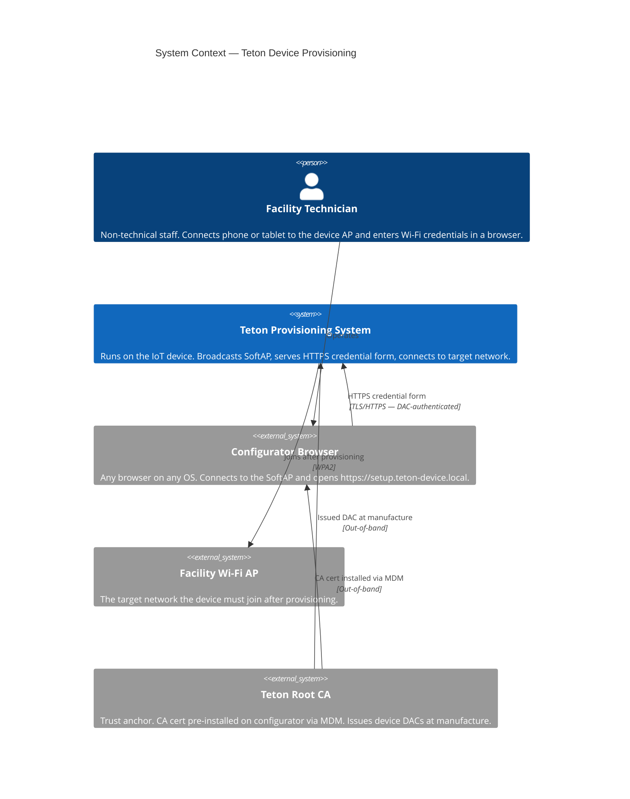
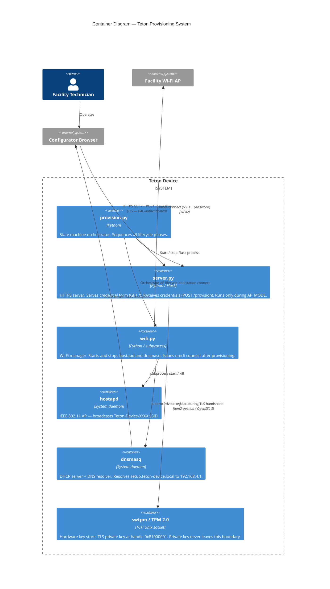
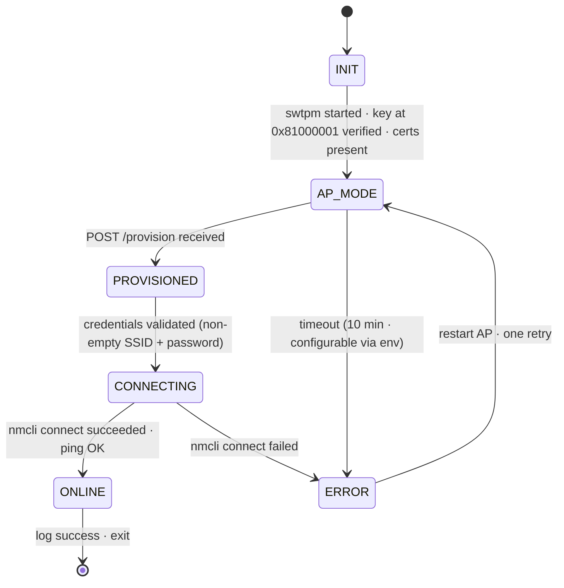
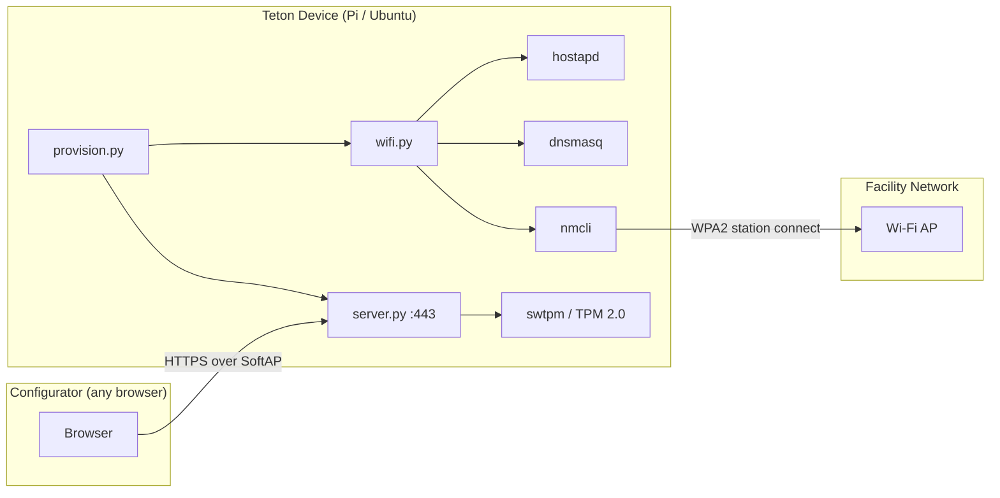

# teton-challenge — Architecture

## 1. Overview

A hardware-backed, offline-first provisioning system for IoT devices. The Teton Device broadcasts a Wi-Fi access point; a facility technician connects via any browser, is authenticated by the device's TPM-signed TLS certificate, and submits Wi-Fi credentials over an encrypted HTTPS channel. The device then tears down the AP and connects to the target network using the received credentials. No internet connection is required at any point during provisioning. The configurator is any browser — no dedicated app is needed.

The trust model relies on a Device Attestation Certificate (DAC) issued to each device at manufacture time, anchored to the Teton CA. The CA certificate is the only out-of-band artefact: distributed once via MDM before field deployment.

### Context Diagram (C4 Level 1)



---

## 2. Key Architectural Decisions

| # | Decision | Rationale | Alternatives Considered |
|---|---|---|---|
| AD-1 | **SoftAP as provisioning channel** | No extra hardware on either side; works on any browser and OS; well-understood IoT pattern; fully reproducible with standard Linux tools | BLE (Linux stack unreliable for demo), Ethernet (requires cable + port), QR/DPP (doesn't scale), NFC (hardware dependency on both sides) |
| AD-2 | **TPM-backed Device Attestation Certificate** | Hardware-bound identity; private key never leaves TPM; single Teton CA cert covers all devices at any fleet size; closes rogue device attack without a dedicated app | Self-signed TLS (encryption without authentication — fails under rogue AP), PAKE (high implementation cost, no meaningful advantage here), cert pinning (requires O(n) cert distribution at fleet scale) |
| AD-3 | **DNS + known URL over captive portal** | Captive portal CNAs are HTTP-based, exempt from MDM browser policies, and behave inconsistently across iOS/Android/Windows; DNS + known URL (`setup.teton-device.local`) works identically in every standard browser | OS captive portal (CNA quirks), manual IP entry (`192.168.4.1` — fragile UX for non-developers) |
| AD-4 | **Python 3 + Flask** | The provisioning server handles one GET and one POST then shuts down; no async required; immediately readable by any evaluator; Python TSS2 ecosystem is more mature than Rust `tss-esapi` for TPM integration | Rust (less mature TPM crate), FastAPI (unnecessary for 2 routes), Node.js (no benefit over Flask here) |
| AD-5 | **tpm2-openssl (OpenSSL 3 provider)** | Available in Pi OS Bookworm and Ubuntu 22.04+ via apt; Flask `ssl` module loads TPM key via OpenSSL provider — one line change; `tpm2-tss-engine` has broken OpenSSL 3.0 deprecated RSA function builds on Bookworm | `tpm2-tss-engine` (deprecated, broken on Bookworm), direct TPM2 TSS bindings (bypasses ssl module integration) |
| AD-6 | **swtpm for demo** | Same API as physical TPM 2.0 (TCTI Unix socket); swap to real hardware with no code changes; available via standard apt; evaluator system TPM is never accessed | Physical TPM only (limits reproducibility), mock TPM (defeats demonstrating real hardware-backed identity) |
| AD-7 | **HSTS for HTTP rogue portal mitigation** | Dynamic HSTS headers close the HTTP-redirect gap; HSTS preload (baked into browser binary at compile time, works fully offline) is the production hardening step — demo sets headers, preload requires formal domain submission | Dedicated app with cert pinning (additional implementation cost; preload achieves equivalent protection using a standard browser) |

---

## 3. Technology Stack

| Layer | Technology | Version | Justification |
|---|---|---|---|
| Provisioning server | Python 3 + Flask | Python 3.11+, Flask 3.x | Minimal, readable; handles 2 routes and shuts down |
| TLS / TPM integration | tpm2-openssl (OpenSSL 3 provider) | OpenSSL 3.x | Native apt package; `ssl.SSLContext` loads TPM handle directly |
| TPM simulation (demo) | swtpm | latest apt | TCTI Unix socket — identical API to physical TPM 2.0 |
| SoftAP | hostapd | latest apt | Standard Linux Wi-Fi AP daemon |
| DHCP + DNS | dnsmasq | latest apt | One config line adds DNS for `setup.teton-device.local`; already needed for DHCP |
| Network management | nmcli (NetworkManager) | latest apt | Standard on Pi OS and Ubuntu; handles station connect and disconnect |
| CA / cert tooling | OpenSSL CLI | 3.x | One-time setup script; signs device CSR with Teton demo CA |
| Test framework | pytest | latest | Standard Python test runner |
| Integration test HTTP | requests | latest | Issues HTTPS requests against Flask test server with custom CA |
| E2E wireless simulation | mac80211_hwsim | kernel module | Full Linux wireless stack; 3 virtual radios; no physical hardware needed |

---

## 4. Component Architecture

### Container Diagram (C4 Level 2)



### State Machine



### Component Breakdown

| Component | Type | Responsibility | Governing ADs |
|---|---|---|---|
| `provision.py` | Server | State machine entry point. Sequences INIT → AP_MODE → PROVISIONED → CONNECTING → ONLINE. Manages process lifecycle (swtpm, hostapd, dnsmasq, Flask). | AD-1, AD-6 |
| `server.py` | Server | Flask HTTPS app. Two routes: `GET /` serves credential form; `POST /provision` validates and returns credentials to orchestrator. Sets HSTS response header. Shuts down after successful POST. | AD-3, AD-4, AD-7 |
| `wifi.py` | Server | Wraps `hostapd`, `dnsmasq`, and `nmcli` subprocess calls. Owns the SoftAP bring-up/tear-down sequence and the final station connect. | AD-1, AD-3 |
| `hostapd` | System daemon | Broadcasts the SoftAP SSID as an open AP (no PSK). Interface read from `PROVISION_IFACE` env var (default `wlan0`). Config in `device/hostapd.conf`. | AD-1 |
| `dnsmasq` | System daemon | DHCP on SoftAP subnet + DNS resolution for `setup.teton-device.local → 192.168.4.1`. Interface read from `PROVISION_IFACE`. Config in `device/dnsmasq.conf`. | AD-3 |
| `swtpm / TPM 2.0` | Hardware / daemon | Key storage at persistent handle `0x81000001`. Signs TLS handshake challenges. Private key generated inside the TPM at setup time — never exported. | AD-2, AD-5, AD-6 |
| `setup.sh` | Script | One-time setup: starts swtpm, generates Teton demo CA, generates key in TPM, signs device CSR with demo CA, outputs `certs/device.crt` and `certs/teton-ca.crt`. Idempotent (wipes swtpm state before each run). | AD-2, AD-5, AD-6 |

---

## 5. Data Model

No persistent storage. All data is in-flight for the duration of one provisioning session.

**Provision request payload** (POST /provision body, `application/x-www-form-urlencoded`):

| Field | Type | Validation |
|---|---|---|
| `ssid` | string | Non-empty |
| `password` | string | Non-empty |

**State machine enum:**

```
ProvisionState = { INIT, AP_MODE, PROVISIONED, CONNECTING, ONLINE, ERROR }
```

**TLS certificate chain** (in-memory during TLS handshake):

```
teton-ca.crt                   Root of trust — installed on configurator via MDM
  └── device.crt               Device Attestation Certificate — CN=setup.teton-device.local
        └── key @ 0x81000001   Private key — never leaves TPM boundary
```

---

## 6. API Design

The provisioning server exposes two routes. It is live only during AP_MODE and shuts down after a successful POST.

| Method | Path | Description | Auth |
|---|---|---|---|
| `GET` | `/` | Returns HTML credential form. | TLS DAC (verified during handshake) |
| `POST` | `/provision` | Receives `ssid` + `password` (form-encoded). Validates non-empty. Returns success or error page. Triggers PROVISIONED state transition. | TLS DAC (verified during handshake) |

All routes are served over HTTPS only (port 443). Every response includes `Strict-Transport-Security: max-age=31536000`.

---

## 7. Infrastructure & Deployment

### Deployment Diagram



### Bare-Metal Requirements

**Target platforms:** Ubuntu 22.04+, Raspberry Pi OS Bookworm (64-bit)

**System packages (apt):**
```
hostapd dnsmasq network-manager tpm2-tools tpm2-openssl swtpm python3 python3-pip openssl
```

**Python runtime packages (`requirements.txt`):**
```
flask
```

**One-time setup:** `sudo ./scripts/setup.sh`

**Run:** `sudo python3 device/provision.py`

**Platform notes:**
- Requires `root` for port 443, `hostapd`, `dnsmasq`, and `nmcli`
- On Raspberry Pi: the BCM43xx handles AP and station roles sequentially — the SoftAP must be torn down before `nmcli connect`; concurrent AP + station mode is not supported on this chip

### CI/CD

Not applicable for this submission. Manual setup and run per README.

---

## 8. Test Strategy

### Test Levels

| Level | Scope | Tools | Coverage Target |
|---|---|---|---|
| Unit | State machine transitions, credential validation, subprocess argument construction, cert path verification | pytest, `unittest.mock` | All state transitions and all validation paths |
| Integration | Flask server with real swtpm: TLS handshake, `GET /`, `POST /provision` with real cert chain | pytest, swtpm pytest fixture, `requests` with custom CA | Happy path + validation failures |

### Test Architecture

```
tests/
├── conftest.py               # Shared fixtures: swtpm lifecycle, temp cert dirs
├── unit/
│   ├── test_state_machine.py
│   ├── test_validation.py
│   └── test_wifi_commands.py
└── integration/
    ├── conftest.py           # Flask test client + dedicated swtpm fixture
    └── test_server.py
```

### Test Isolation

Tests are strictly isolated from the demo environment:

- **swtpm:** Integration tests spawn a dedicated swtpm instance scoped to `pytest.tmp_path` — separate socket path and state directory from the demo's `/tmp/tpm-state` and `/tmp/tpm.sock`. The demo's persistent handle `0x81000001` is never accessed from tests.
- **Certs:** Tests generate short-lived test CA and device certs in `pytest.tmp_path`. The demo's `certs/` directory is never read or written by tests.
- **Environment variables:** Test fixtures set their own `TPM2TOOLS_TCTI` and `TSS2_TCTI` values scoped to the test process. They do not read or depend on the demo's exported env vars.

### Test Dependencies

Tracked separately from runtime dependencies. All test dependencies are listed in README.

**`requirements-test.txt`:**
```
pytest
requests
```

**E2E additional system packages (documented in README, requires root):**
```
linux-modules-extra-$(uname -r)   # provides mac80211_hwsim
wpasupplicant
iw
```

E2E tests must be run explicitly (`pytest tests/e2e/`) and require:
- Root access
- `modprobe mac80211_hwsim radios=3` loaded before the test session
- NetworkManager not managing the virtual interfaces

### What NOT to Test

- `hostapd`, `dnsmasq`, `nmcli` internal behavior — OS tools, not our code
- TLS protocol correctness — delegated to OpenSSL
- TPM cryptographic operations — delegated to `tpm2-openssl`
- Browser rendering of HTML templates

---

## 9. Security Considerations

### Threat Surface

| Vector | Description | Mitigation |
|---|---|---|
| Rogue HTTPS device | Attacker broadcasts identical SSID, serves HTTPS with any cert | Browser rejects — attacker cannot obtain a cert signed by Teton CA; hardware TPM required to hold a valid key |
| Rogue HTTP device | Attacker serves plain HTTP on `setup.teton-device.local` | HSTS response header on all responses; HSTS preload (production) bakes HTTPS-only into browser binary, works fully offline |
| Credential interception | Passive or active MitM captures POST body | Closed by TLS encryption — session key established via authenticated handshake |
| Physical TPM extraction | Attacker removes device storage and reads private key | Private key generated inside TPM, never exported; no software path to extract it |
| swtpm key material on disk | swtpm stores key material in `/tmp/tpm-state` — accessible to root on the demo machine | Accepted demo trade-off; documented as demo-only; production uses physical TPM |
| Replay of provisioning request | Attacker captures HTTPS POST and replays it | TLS 1.3 ephemeral key exchange — captured sessions cannot be replayed |
| Repeated POST attempts | Repeated provisioning attempts against the running server | Server accepts one valid POST then shuts down; no repeated-attempt surface |

### Authentication & Authorization

- **Auth mechanism:** TLS. Device presents DAC (CN=`setup.teton-device.local`, signed by Teton CA). Browser verifies against pre-installed Teton CA cert.
- **No user authentication:** The credential form is accessible to any device that can reach the server on the SoftAP subnet. Physical proximity to the device is the access control boundary.
- **Session lifetime:** Flask server is live only during AP_MODE. It exits after one successful POST. No session tokens; no cookies.

### Input Validation

- `ssid`: non-empty string — enforced in `POST /provision` handler before passing to `wifi.py`
- `password`: non-empty string — same
- Credentials are passed to `nmcli` as discrete arguments, not interpolated into a shell string — no shell injection surface

### Secrets Management

In production, Teton holds `teton-ca.key` in an HSM and pre-signs device certs at manufacture. The evaluator never sees it.

In the demo, `setup.sh` simulates the full Teton manufacturing step locally. The evaluator plays every role:

```
setup.sh (runs on evaluation machine):
  1. Generates teton-ca.key + certs/teton-ca.crt   ← evaluator acts as Teton CA
  2. Generates TPM key at 0x81000001
  3. Creates device.csr from TPM public key
  4. Signs device.csr with teton-ca.key → certs/device.crt
  5. teton-ca.key stays on disk — used if setup.sh is re-run; never committed
```

After `setup.sh`, the evaluator installs `certs/teton-ca.crt` on their browser via `install-ca.sh`. The entire `certs/` directory is gitignored — `setup.sh` generates all files at evaluation time.

| Secret | Location | Notes |
|---|---|---|
| Device private key | TPM handle `0x81000001` | Never exported; never in a file |
| `teton-ca.key` | `certs/teton-ca.key` — local only, gitignored | Generated by `setup.sh`; used to sign `device.crt`; never committed |
| `certs/device.crt` | Local only, gitignored | Public cert; generated by `setup.sh`; presented by Flask during TLS handshake |
| `certs/teton-ca.crt` | Local only, gitignored | Public cert; generated by `setup.sh`; installed on evaluator's browser via `install-ca.sh` |

### Known Risks & Accepted Trade-offs

| Risk | Severity | Accepted? | Justification |
|---|---|---|---|
| swtpm key material on disk | Medium | Yes — demo only | Documented; production uses physical TPM |
| No HSTS preload on `setup.teton-device.local` | Medium | Yes — demo only | Preload requires formal domain submission; evaluators navigate directly to `https://`; documented as production step |
| No mutual TLS (client auth) | Low | Yes | Device identity is the security requirement; configurator identity is not — any technician with physical proximity is authorized |
| Port 443 requires root | Low | Yes | Bare-metal provisioning daemon on a dedicated embedded device |

---

## 10. Observability

- **Logging:** Python `logging` module, format `%(asctime)s %(levelname)s %(message)s`. One log line per state transition at INFO level. Errors include exception info.
- **State transitions logged at INFO:** `INIT`, `AP_MODE`, `PROVISIONED`, `CONNECTING`, `ONLINE`, `ERROR`
- **Submission evidence:** Terminal log output + browser screenshots (form, success/failure page) + `ip addr` + `ping` output post-provisioning

No external logging infrastructure. Standalone embedded provisioning daemon.

---

## 11. Open Questions

- [ ] Production deployment mechanism: systemd unit file (auto-start on boot) — deferred pending Pi deployment details
- [ ] `CAP_NET_BIND_SERVICE` as alternative to full `root` for port 443 — deferred

---

## 12. Deferred to Tickets

- Exact `hostapd.conf` values: channel number, `hw_mode`, `ssid` format (how is the `Teton-Device-XXXX` suffix derived?) — AP is open (no PSK)
- `PROVISION_IFACE` env var: exact name TBD; read at startup by `provision.py`; default `wlan0`; applied to `hostapd.conf`, `dnsmasq.conf`, and `nmcli` calls
- Exact `dnsmasq.conf` values: subnet range, lease time, interface binding
- Exact `nmcli` command syntax: hidden vs visible SSID handling, error output parsing
- E2E test: `mac80211_hwsim` load/unload as pytest fixture vs manual pre-condition
- `setup.sh` idempotency behavior when swtpm is already running
- Flask port: 443 with `sudo` vs alternative port with `CAP_NET_BIND_SERVICE`
- Provisioning timeout env var name (default 10 min)
- Cert validity periods in `setup.sh` (CA: 10 years, device cert: 1 year — suggested)
- `certs/` is fully gitignored — all files generated by `setup.sh` at evaluation time; no pre-committed certs or keys
- `install-ca.sh` platform detection logic (Ubuntu vs Pi OS vs macOS fallback)

---

## 13. Submission Responses

The following sections answer the three specific questions required by the challenge brief.

---

### 13.1 — Why this communication channel, and what was traded off?

**Choice: Wi-Fi SoftAP**

The Teton Device broadcasts a Wi-Fi access point via `hostapd`. The configurator connects to it and opens a browser. Credentials are submitted via an HTTPS form served by the device.

**Why SoftAP:**

- **No extra hardware on either side.** Every phone, tablet, and laptop can connect to a Wi-Fi AP and open a browser. No app, no dongle, no cable.
- **No shared infrastructure.** The channel is self-contained between the two devices — no existing network, no internet, no cloud relay. Satisfies the hard no-internet constraint directly.
- **Usable by a non-developer.** "Connect to Teton-Device-XXXX Wi-Fi, open browser, type setup.teton-device.local" is a flow a facilities technician can follow in a hospital hallway.
- **Well-understood IoT pattern.** Reproducible on any Linux device with a Wi-Fi interface using standard apt packages. Fully testable without physical hardware using `mac80211_hwsim`.

**Trade-offs accepted:**

- **One device at a time.** SoftAP is a point-to-point flow: one technician, one device, one session. For simultaneous provisioning at scale, see Section 13.3.
- **Technician must manually connect to the SoftAP.** Most platforms show a captive portal notification automatically; some require manual browser navigation. Accepted for the benefit of requiring no dedicated app.
- **The SSID is not a security boundary.** Any device can broadcast the same SSID. This is not a weakness — security is enforced entirely at the TLS layer (see Section 13.2), making SSID spoofing irrelevant.

**Channels rejected:**

| Channel | Reason rejected |
|---|---|
| BLE | Linux BlueZ stack unreliable for demo; hard to reproduce on Ubuntu without dedicated hardware |
| Ethernet | Eliminates wireless attack surface entirely but requires a physical cable and exposed port — not viable for field deployment |
| QR code / DPP | Doesn't scale past ~3 devices; sticker-based; scanning is a fragile UX step at volume |
| PAKE (SPAKE2, J-PAKE) | Cryptographically sound but high implementation cost; no advantage over DAC for this fleet model |
| NFC | Hardware dependency on both sides; short range makes multi-device awkward |

---

### 13.2 — How are credentials protected in transit?

**TLS with hardware-bound Device Attestation Certificate (DAC)**

Credentials are submitted over HTTPS. The TLS layer provides both **encryption** (credentials cannot be read in transit) and **authentication** (the device presenting the cert is a genuine Teton device, not a rogue AP). Both properties are required. Encryption alone is not sufficient.

**Why self-signed TLS is insufficient:**

Self-signed TLS provides encryption only. A rogue device with an identical SSID and a self-signed cert is indistinguishable from the real device. A non-developer receives a browser warning, clicks through, and submits credentials to the attacker. The SSID is not a trust anchor.

**The DAC model:**

```
Production:
  At manufacture:
    Device generates RSA key pair inside TPM (private key never leaves hardware)
    Teton CA (HSM-backed) signs the device public key → Device Attestation Certificate (DAC)
    DAC stored on device (public cert — not sensitive)
  Before field deployment (internet available, one-time per configurator):
    MDM pushes Teton CA cert to configurator → installed in browser trust store

Demo (simulated by setup.sh on the evaluation machine):
  Evaluator acts as Teton CA:
    setup.sh generates teton-ca.key + teton-ca.crt (self-signed)
    setup.sh generates TPM key in swtpm, signs device CSR → device.crt
    Evaluator installs teton-ca.crt on their browser via install-ca.sh
  Same machine or separate device acts as configurator

At provisioning (no internet, identical in both models):
  TLS handshake:
    Device presents DAC (CN=setup.teton-device.local, signed by Teton CA)
    Browser verifies DAC chain against pre-installed Teton CA cert → valid
    TLS session established — encrypted + authenticated
    Browser is certain it is communicating with a device whose cert Teton CA signed
  POST /provision:
    SSID + password transmitted inside the TLS session
    Any eavesdropper sees only ciphertext
```

**Why one CA cert covers all devices:**

The browser does not compare against a list of device certs — it verifies the chain: was this cert signed by the Teton CA? One CA cert, installed once, covers every Teton device ever manufactured. Adding the 10,001st device requires no update on the configurator side. This is the core advantage over cert pinning, which would require pre-distributing O(n) device certs to every configurator.

**HSTS — closing the HTTP gap:**

The first browser visit could theoretically be intercepted via HTTP before an HTTPS redirect occurs. Mitigations in layers:

1. **Demo:** HSTS response header (`max-age=31536000`) on every response. After first visit, browser enforces HTTPS-only for this domain.
2. **Production:** `setup.teton-device.local` submitted to the HSTS preload list. The preload list is compiled into every browser binary — HTTPS is enforced on the very first visit, fully offline, with no prior browsing history needed.

**Attack matrix:**

| Attack | Closed by |
|---|---|
| Rogue HTTPS device | Attacker cannot obtain a Teton CA-signed cert — browser rejects the handshake |
| Rogue HTTP device | HSTS preload (production): browser refuses HTTP for this domain regardless of network |
| Passive eavesdropping | TLS encryption |
| Replay attack | TLS 1.3 ephemeral key exchange — captured sessions cannot be replayed |

---

### 13.3 — How does this change for 200 simultaneous devices?

**Simultaneously** — 200 devices being provisioned at the same time in a hospital wing, by non-technical staff. SoftAP is a one-at-a-time flow; it does not scale to this scenario directly. Three production models, in order of preference:

**Model 1 — Zero-touch pre-provisioning (best for simultaneous scale)**

Wi-Fi credentials are injected at manufacture or warehouse staging before devices ship to the facility. Every device arrives knowing its target network. The technician plugs it in — provisioning already happened. No field provisioning step at all.

- *Requires:* Target SSID + credentials known at staging time. Works well for facilities with stable network infrastructure.
- *Security:* Credentials sealed in TPM at staging. Same hardware trust model.
- *Throughput:* Unbounded — all 200 devices provisioned in parallel the moment they are powered on.

**Model 2 — BLE broadcast + managed provisioning tablet**

Devices beacon via BLE advertising. A Teton-issued managed Android tablet runs a provisioning app that discovers all nearby devices by BLE UUID, lists them, and provisions them sequentially via the SoftAP flow (~30–60 seconds each). One technician walks the wing with one tablet.

- *Capacity:* 200 devices ÷ ~1 min each ≈ 3–4 hours per technician. Parallelisable: 4 tablets = ~45–60 min total.
- *Security:* BLE identifies the device; actual credential transfer still uses TPM + TLS — same trust model, app replaces manual browser navigation.
- *Hardware:* Teton-issued managed Android tablet (~€150–200). Single OS, full MDM control.

**Model 3 — Provisioning station (high-throughput staging)**

Ethernet switch in a staging room. Devices connect physically; credentials pushed over wire before deployment to the wing. Physical medium eliminates the wireless attack surface entirely.

- *Best for:* High-security environments, pre-deployment staging rooms, situations where devices are assembled before installation.
- *Limitation:* Requires devices to be brought to staging before deployment.

**The SoftAP demo as foundation:**

The SoftAP flow in this submission demonstrates the **trust model** — TPM-backed device identity, CA-signed certs, authenticated TLS — that underpins all three production approaches. The provisioning transport changes at scale; the security architecture does not.
